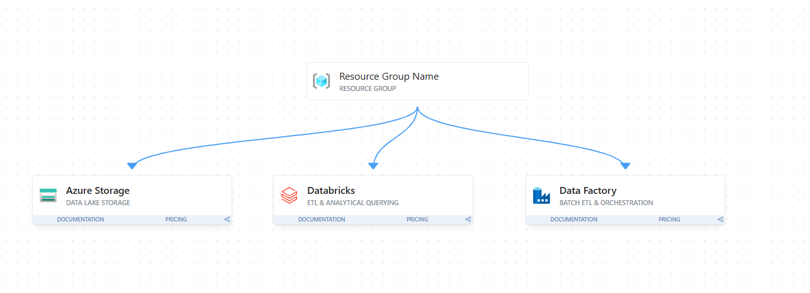

# Azure Lakehouse – Incremental Sales Analytics Pipeline

A fully functional Data Engineering portfolio project demonstrating an end-to-end Medallion Architecture (Lakehouse) on Azure. The pipeline automatically ingests, validates, cleans, and aggregates synthetic sales data using PySpark, Delta Lake, and Azure Data Factory.

> **Provenance Note**  
> This repository consolidates and refactors work developed during Azure Data Engineering technical training. Company/client-specific information and proprietary data have been removed or replaced with generalized/synthetic examples for portfolio use. The original Azure resources have been decommissioned to prevent ongoing cloud costs, so this repository serves as a reference implementation.

---

## Technical Architecture



This pipeline follows the Medallion Architecture:
- **Source**: Raw data lands in an ADLS Gen2 `landing` container.
- **Data Factory**: Orchestrates a Copy activity to securely move data into the Lakehouse `raw` tier, triggering the Databricks pipeline.
- **Bronze**: PySpark ingests raw data, appending auditing metadata, and performs an idempotent UPSERT into a Delta table.
- **Silver**: Data is cleansed, standardized, deduplicated, and strictly typed.
- **Gold**: Business-level KPIs and aggregations (e.g., Daily Sales, Customer Analytics) are generated for BI reporting.

### Technology Stack
- **Azure Data Factory (ADF)**: Orchestration, triggers, scheduling.
- **Azure Data Lake Storage Gen2 (ADLS)**: Cloud storage.
- **Azure Databricks**: Distributed compute engine.
- **PySpark**: Data transformation logic.
- **Delta Lake**: ACID transactions, schema enforcement, time travel.
- **Python**: Modular pipeline scripting, data generation, unit testing (`pytest`).

---

## Key Features

- **Databricks Native Execution**: The PySpark code is written in Databricks notebook format (`# Databricks notebook source`). The scripts utilize implicit `spark` contexts and `dbutils.widgets` for dynamic parameter passing from ADF.
- **Enterprise Security (Azure Key Vault)**: Hardcoded secrets and environment variables are explicitly avoided. Storage Account Keys are retrieved securely at runtime using Databricks Secret Scopes (`dbutils.secrets.get()`).
- **Infrastructure as Code (IaC)**: Includes a baseline Terraform configuration (`infrastructure/main.tf`) that automates the provisioning of Azure Data Lake Storage Gen2, Azure Databricks, Azure Data Factory, and Azure Key Vault.
- **Simulated API Ingestion**: A dedicated PySpark notebook script is included to mock the ingestion of raw data from an external Sales API directly into the ADLS Landing zone.
- **Incremental Processing**: Utilizes a custom metadata watermark table. PySpark dynamically compares incoming data timestamps against the watermark, fetching only new records.
- **Idempotency**: Leveraging Delta Lake's `MERGE INTO` capabilities, the pipeline is fully idempotent. If a cluster dies halfway, rerunning the pipeline will not result in duplicated data.
- **Data Quality (Silver Layer)**: Implements strict validation. Null values in categorical dimensions are coerced, duplicates are removed via Window functions, and schema enforcement is rigid.
- **Performance Optimized**: Z-Ordering and `OPTIMIZE` commands are executed on the Silver tables to ensure blazing-fast downstream querying by BI tools via data-skipping.

---

## Repository Structure

```text
azure-lakehouse-sales-pipeline/
├── infrastructure/
│   └── main.tf                           # Terraform IaC for Azure resources
├── pipelines/
│   └── data-factory/
│       └── pipeline_incremental.json     # ADF pipeline definition
├── src/
│   ├── config/
│   │   └── settings.py                   # Configuration & Pathing
│   ├── transformations/
│   │   ├── bronze_ingestion.py           # Raw -> Bronze logic
│   │   ├── silver_cleansing.py           # Bronze -> Silver logic
│   │   └── gold_aggregations.py          # Silver -> Gold logic
│   ├── utilities/
│   │   ├── adls_mount.py                 # Databricks DBFS mounting & Key Vault integration
│   │   └── simulate_api_ingestion.py     # Databricks mock API fetcher
│   └── main.py                           # Databricks main orchestrator notebook
├── data/
│   └── sample/
│       └── synthetic_sales_data.csv      # Synthetic sample dataset
├── docs/
│   ├── architecture.md                   
│   ├── incremental-loading.md            
│   ├── data-quality.md                   
│   ├── error-handling.md                 
│   └── performance.md                    
├── tests/
│   └── test_silver_transformations.py    # Pytest unit tests
└── screenshots/                          # Pipeline execution proofs
```

---

## How to Run (Recreation Steps)

If you wish to recreate this pipeline in your own Azure environment, follow these steps:

### 1. Azure Setup
1. **Provision Infrastructure**: Run `terraform apply` on the `infrastructure/main.tf` file to create your ADLS Gen2 Storage Account (with `landing`, `raw`, and `gold` containers), Databricks workspace, Key Vault, and Data Factory.
2. **Configure Security**: Add your Storage Account Key to the Azure Key Vault and create a Databricks Secret Scope (e.g., `sales-kv-scope`) linked to that Key Vault.
3. **Data Factory Settings**: Link ADF to your GitHub repository and create Linked Services for ADLS and Databricks.

### 2. Code Deployment
1. Import the Python scripts from the `src/` folder into your Databricks workspace as Notebooks.
2. Import the `pipelines/data-factory/pipeline_incremental.json` into ADF as a pipeline template, updating the notebook path to your Databricks workspace user folder.

### 3. Execution
1. Run `src/utilities/simulate_api_ingestion.py` in Databricks to generate synthetic sales data into the `landing` container.
2. In ADF, trigger the `Pipeline_Incremental_Sales` pipeline.
3. Monitor the ADF execution as it copies data from `landing` to `raw` and triggers `src/main.py` in Databricks.
4. Open the `gold` container in ADLS to view the final analytical datasets, or query them directly in Databricks SQL using `SELECT * FROM delta.\`/mnt/gold/sales/...\``.

## Future Improvements
- **CI/CD**: Add GitHub Actions workflows to automate `pytest` execution and code deployments on Pull Requests.
- **dbt**: Migrate the Gold layer aggregations from PySpark to dbt-databricks for better analytics engineering practices.
- **Data Quality**: Replace PySpark filters with Great Expectations or Delta Live Tables (DLT) for declarative data quality rules.
