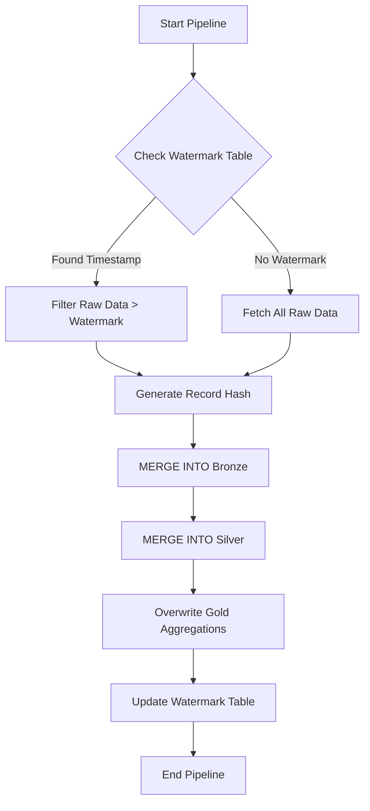

# Incremental Loading Strategy

## How It Works

To optimize pipeline performance and minimize cloud compute costs, this pipeline utilizes an **incremental loading** (or "delta") strategy instead of full truncation and reloading. 

### 1. Watermark Tracking
- A Delta table (`WATERMARK_PATH`) is maintained to track the state of the pipeline.
- It stores the `pipeline_run_id`, `last_processed_timestamp`, and `updated_at`.
- Before ingestion begins, PySpark reads this table to determine the maximum processed timestamp from previous successful runs.

### 2. Identifying New Records
- The ingestion script compares the incoming raw data's `order_date` (or ingestion timestamp depending on source constraints) against the stored watermark.
- Only records with timestamps strictly greater than or equal to the watermark are loaded into the DataFrame for processing.

### 3. Avoiding Duplicates (UPSERT)
- Because incremental processing can occasionally re-fetch records (due to pipeline retries or late-arriving data), the pipeline employs Delta Lake's `MERGE INTO` (UPSERT) capabilities.
- Every record is hashed (`record_hash` using SHA-256) based on its column contents.
- If an `order_id` already exists in the Bronze or Silver table, the pipeline checks if the `record_hash` differs.
- If it differs, the record is updated. If it's identical, it is ignored (idempotent operation).

### 4. Updating the Watermark
- The watermark table is strictly updated *only after* the Bronze, Silver, and Gold transformations have completed successfully.
- If a pipeline fails midway, the watermark remains unchanged, and the next run will safely re-process the exact same batch without corrupting the target tables thanks to the UPSERT logic.

